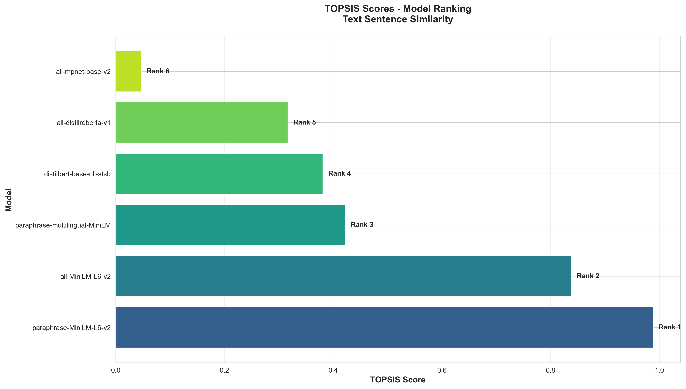
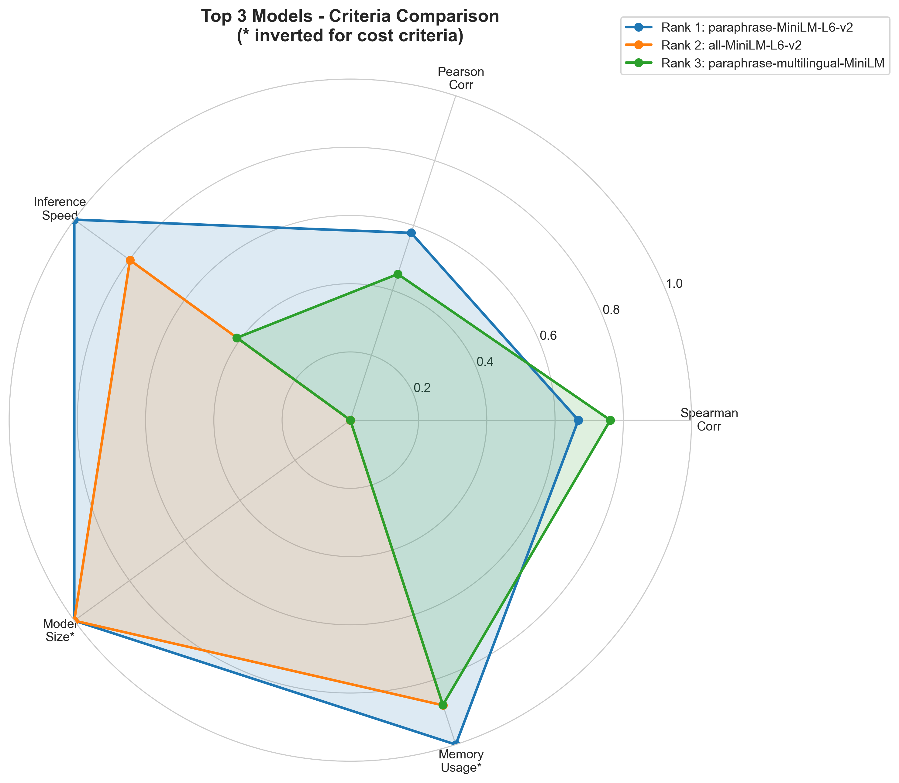
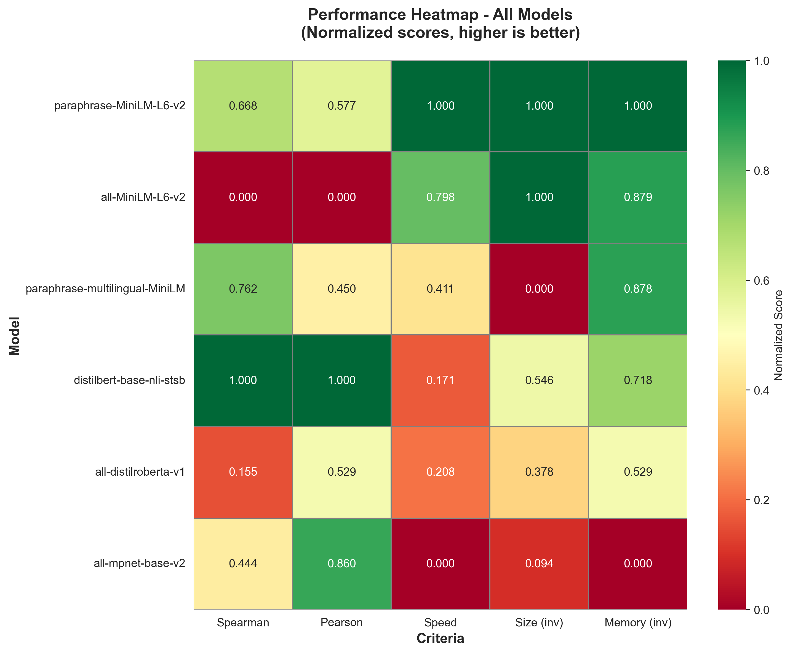
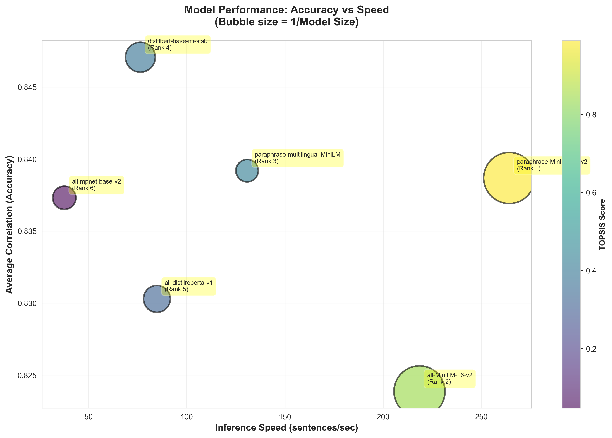
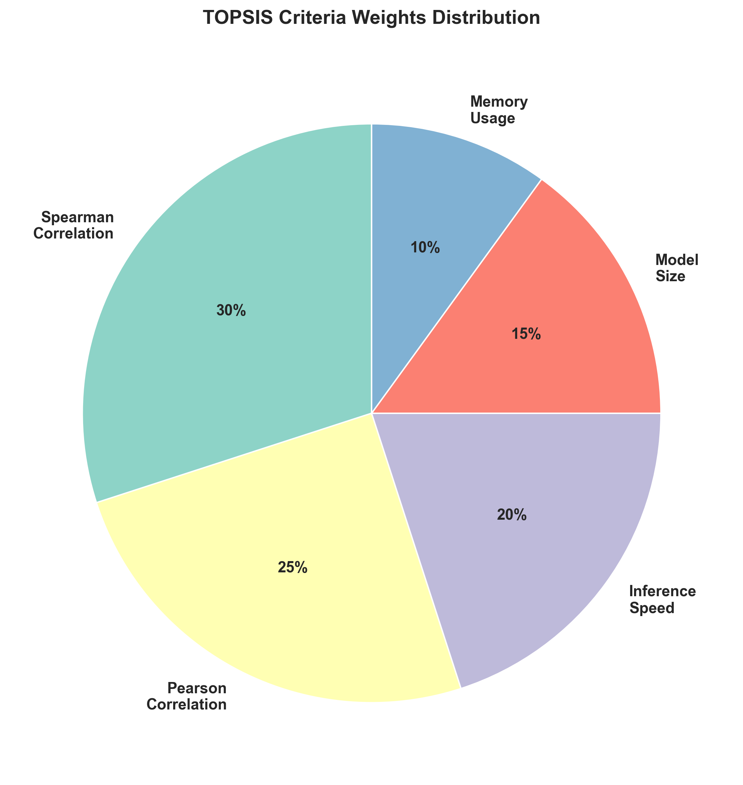
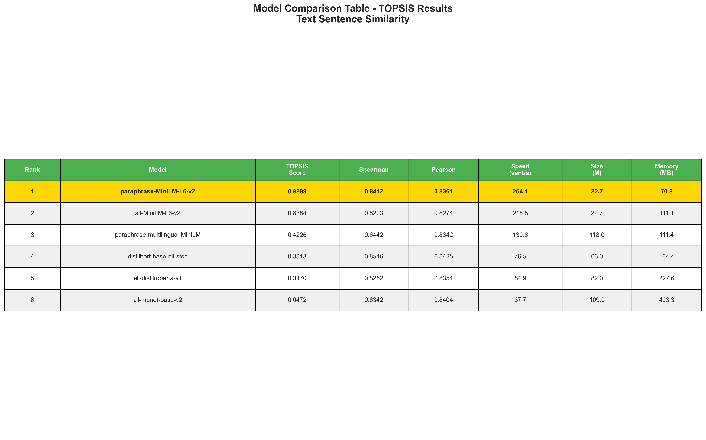

# Text Sentence Similarity - TOPSIS Model Selection

[](https://www.python.org/)
[](https://pypi.org/project/Topsis-Prabhsimar-102483078/)
[](LICENSE)

> **Assignment**: Applying TOPSIS (Technique for Order of Preference by Similarity to Ideal Solution) to find the best pre-trained model for text sentence similarity tasks.

---

## Table of Contents

- [Overview](#overview)
- [Dataset](#dataset)
- [Models Evaluated](#models-evaluated)
- [Evaluation Criteria](#evaluation-criteria)
- [Results](#results)
- [Visualizations](#visualizations)
- [Installation](#installation)
- [Usage](#usage)
- [Project Structure](#project-structure)
- [Conclusion](#conclusion)
- [Author](#author)

---

## Overview

This project evaluates **6 pre-trained sentence transformer models** from HuggingFace on the **STS Benchmark** dataset and uses **TOPSIS multi-criteria decision making** to rank them based on multiple performance metrics.

### Why TOPSIS?

TOPSIS helps identify the best model by considering multiple criteria simultaneously:
- Accuracy (Spearman & Pearson correlation)
- Inference speed
- Model size
- Memory usage

Unlike single-metric comparisons, TOPSIS finds the optimal **balance** across all criteria.

---

## Dataset

**STS Benchmark (Semantic Textual Similarity)**
- Source: `mteb/stsbenchmark-sts`
- Test set: 1,379 sentence pairs
- Labels: Similarity scores (0-5, normalized to 0-1)
- Task: Predict semantic similarity between sentence pairs

---

## Models Evaluated

| Model | Parameters | Description |
|-------|-----------|-------------|
| **all-MiniLM-L6-v2** | 22.7M | Fast, general-purpose embeddings |
| **all-mpnet-base-v2** | 109M | High quality, trained on 1B+ pairs |
| **paraphrase-MiniLM-L6-v2** | 22.7M | Optimized for paraphrase detection |
| **distilbert-base-nli-stsb** | 66M | DistilBERT-based, balanced performance |
| **all-distilroberta-v1** | 82M | RoBERTa-based architecture |
| **paraphrase-multilingual-MiniLM** | 118M | Supports 50+ languages |

---

## Evaluation Criteria

TOPSIS analysis based on 5 weighted criteria (totaling 100%):

| Criterion | Weight | Type | Description |
|-----------|--------|------|-------------|
| **Spearman Correlation** | 30% | Benefit (↑) | Ranking quality metric |
| **Pearson Correlation** | 25% | Benefit (↑) | Linear correlation metric |
| **Inference Speed** | 20% | Benefit (↑) | Sentences processed per second |
| **Model Size** | 15% | Cost (↓) | Number of parameters (millions) |
| **Memory Usage** | 10% | Cost (↓) | RAM usage (MB) |

---

## Results

### TOPSIS Ranking

| Rank | Model | TOPSIS Score | Spearman | Pearson | Speed (sent/s) | Size (M) | Memory (MB) |
|------|-------|--------------|----------|---------|----------------|----------|-------------|
| **🥇 1** | **paraphrase-MiniLM-L6-v2** | **0.9889** | 0.8412 | 0.8361 | **264.13** | **22.7** | **70.82** |
| 🥈 2 | all-MiniLM-L6-v2 | 0.8384 | 0.8203 | 0.8274 | 218.49 | 22.7 | 111.08 |
| 🥉 3 | paraphrase-multilingual-MiniLM | 0.4226 | **0.8442** | 0.8342 | 130.77 | 118.0 | 111.43 |
| 4 | distilbert-base-nli-stsb | 0.3813 | **0.8516** | **0.8425** | 76.45 | 66.0 | 164.44 |
| 5 | all-distilroberta-v1 | 0.3170 | 0.8252 | 0.8354 | 84.86 | 82.0 | 227.59 |
| 6 | all-mpnet-base-v2 | 0.0472 | 0.8342 | 0.8404 | 37.74 | 109.0 | 403.33 |

### Winner: paraphrase-MiniLM-L6-v2

**Why it won (TOPSIS Score: 0.9889):**

**Fastest model**: 264.13 sentences/second (7x faster than all-mpnet-base-v2)  
**Most efficient**: Smallest size (22.7M) & lowest memory (70.82 MB)  
**High accuracy**: Spearman 0.8412 (only 1.2% below highest)  
**Production-ready**: Optimal balance for real-world deployment  

### Key Insights

1. **Most accurate ≠ Best overall**: 
   - `distilbert-base-nli-stsb` had highest accuracy (0.8516) but ranked 4th
   - 3.5x slower and 2.3x larger than winner
   - TOPSIS reveals: tiny accuracy gain not worth the efficiency loss

2. **Speed matters**: 
   - `all-mpnet-base-v2` ranked last despite good accuracy
   - Extremely slow (37.74 sent/s) and memory-heavy (403 MB)

3. **Balance is optimal**:
   - Winner excels across ALL criteria, not just one

---

## Visualizations

### 1. TOPSIS Scores Ranking


### 2. Top 3 Models Comparison (Radar Chart)


### 3. Performance Heatmap


### 4. Accuracy vs Speed Trade-off


### 5. TOPSIS Criteria Weights


### 6. Detailed Comparison Table


---

## Installation

### Prerequisites
- Python 3.10+
- Miniconda/Anaconda (recommended)

### Setup

1. **Clone the repository**:
   ```bash
   git clone https://github.com/YOUR_USERNAME/sentence-similarity-topsis.git
   cd sentence-similarity-topsis
   ```

2. **Create conda environment**:
   ```bash
   conda create -n sentence_sim python=3.10 -y
   conda activate sentence_sim
   ```

3. **Install dependencies**:
   ```bash
   pip install -r requirements.txt
   ```

4. **Install custom TOPSIS package**:
   ```bash
   pip install Topsis-Prabhsimar-102483078
   ```

---

## Usage

### Quick Start - Run All Steps

```bash
# 1. Test setup (optional)
python test_setup.py

# 2. Evaluate models (~15-20 minutes)
python evaluate_models.py

# 3. Run TOPSIS analysis
python run_topsis.py

# 4. Create visualizations
python create_visualizations.py
```

### Step-by-Step Breakdown

#### 1. **Model Evaluation**
```bash
python evaluate_models.py
```
- Loads STS Benchmark dataset
- Evaluates all 6 models
- Measures: correlations, speed, size, memory
- Outputs: `results/model_evaluation_results.csv`

#### 2. **TOPSIS Analysis**
```bash
python run_topsis.py
```
- Uses custom TOPSIS package
- Applies multi-criteria decision making
- Outputs: `results/topsis_output.csv`, `results/topsis_analysis_summary.txt`

#### 3. **Generate Visualizations**
```bash
python create_visualizations.py
```
- Creates 6 professional charts
- Outputs: 6 PNG files in `results/` folder

---

## Project Structure

```
sentence_similarity_topsis/
│
├── 📄 README.md                        # This file
├── 📄 requirements.txt                 # Python dependencies
├── 📄 .gitignore                       # Git ignore rules
│
├── 🐍 model_config.py                  # Model & criteria configurations
├── 🐍 evaluate_models.py               # Model evaluation script
├── 🐍 run_topsis.py                    # TOPSIS analysis script
├── 🐍 create_visualizations.py         # Visualization generation
├── 🐍 test_setup.py                    # Setup verification
│
└── 📊 results/                         # All outputs
    ├── model_evaluation_results.csv    # Raw evaluation data
    ├── model_evaluation_results.json   # Evaluation data (JSON)
    ├── topsis_input.csv                # TOPSIS input
    ├── topsis_output.csv               # TOPSIS results & rankings
    ├── topsis_analysis_summary.txt     # Detailed summary
    ├── topsis_scores_ranking.png       # Visualization 1
    ├── top3_radar_chart.png            # Visualization 2
    ├── criteria_heatmap.png            # Visualization 3
    ├── accuracy_vs_speed.png           # Visualization 4
    ├── criteria_weights.png            # Visualization 5
    └── comparison_table.png            # Visualization 6
```

---

## Conclusion

### Recommendation

**For Production Deployment**: Use **paraphrase-MiniLM-L6-v2**
- Best overall balance of accuracy, speed, and efficiency
- TOPSIS Score: 0.9889 (near perfect)
- Ideal for resource-constrained environments

**For Maximum Accuracy**: Use **distilbert-base-nli-stsb**
- Highest Spearman correlation: 0.8516
- Trade-off: 3.5x slower, 3x larger
- Use when accuracy is the only priority

**For Multilingual Support**: Use **paraphrase-multilingual-MiniLM**
- Supports 50+ languages
- Good balance of multilingual capability and performance

### TOPSIS Value Demonstrated

This project demonstrates that:
1. **Single-metric optimization** can be misleading
2. **Multi-criteria analysis** reveals better real-world choices
3. **TOPSIS** effectively balances competing objectives
4. **Production deployments** require considering speed, size, and accuracy together

---

## Author

**Prabhsimar Singh**  
Roll Number: 102483078  
Course: UCS654 - Predictive Analysis using Statistics

### Custom TOPSIS Package

This project uses my custom TOPSIS implementation:
- **Package**: [Topsis-Prabhsimar-102483078](https://pypi.org/project/Topsis-Prabhsimar-102483078/)
- **Version**: 1.0.5
- **Published**: PyPI (Python Package Index)

---

## References

1. [Sentence Transformers Documentation](https://www.sbert.net/)
2. [HuggingFace Models](https://huggingface.co/sentence-transformers)
3. [STS Benchmark Dataset](https://huggingface.co/datasets/mteb/stsbenchmark-sts)
4. [TOPSIS Method](https://en.wikipedia.org/wiki/TOPSIS)

---

## License

This project is licensed under the MIT License - see the [LICENSE](LICENSE) file for details.

---

## Acknowledgments

- HuggingFace for providing pre-trained models and datasets
- Sentence Transformers library developers
- Course instructors for assignment guidance

---

**⭐ If you found this project helpful, please star the repository!**